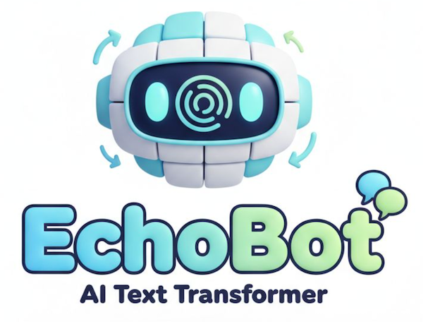

# EchoBot

<p align="center">
  
</p>

EchoBot is a T5 transformer model that can be easily fine-tuned (by high school level students) with small datasets without a lot of GPU overhead. It is designed to demonstrate how fine-tuning works, what's possible, and what are the limitations.

To use EchoBot, students select a dataset, click **Train**, and within seconds (GPU) or a few minutes (CPU) EchoBot learns to apply the transformation to new inputs.

## Live demo

[EchoBot on HuggingFace Spaces](https://huggingface.co/spaces/simonguest/echobot)

## Datasets

| Dataset | What it learns |
|---|---|
| Falsification | Replace adjectives/states with their antonyms |
| Reversal | Reverse the word order of a sentence |
| Statement-to-Question | Convert declarative sentences to yes/no questions |
| Past to Present Tense | Convert past-tense sentences to present tense |
| Formalization | Convert informal/colloquial language to formal English |
| Capitalizing Proper Nouns | Fix capitalization of names and places |

Each dataset contains ~12 `(input, output)` example pairs. Training on such a tiny set is intentional — the goal is to demonstrate few-shot fine-tuning with T5.

## How to use

1. **Pick a dataset** from the dropdown. The table shows the training examples.
2. **Adjust hyperparameters** (epochs, learning rate, inference beams) if desired.
3. **Click "Train EchoBot"** — a live loss graph updates each epoch.
4. **Chat** with EchoBot to test the transformation on new inputs.
5. **Click "Reset EchoBot"** to wipe the weights and try another dataset.

Each browser session has its own independent model, so multiple users don't interfere with each other.

## Technical details

- **Model:** [`t5-base`](https://huggingface.co/t5-base) (encoder-decoder, ~250M parameters)
- **Optimizer:** AdamW
- **Default hyperparameters:** 10 epochs, lr=3e-4, 10 inference beams
- **Input format:** `generate: {input}</s>`
- **Device:** auto-detected (CPU / CUDA / MPS)
- **GPU on Spaces:** ZeroGPU via `@spaces.GPU`

## Project structure

```
notebook/EchoBot.ipynb   # Original Jupyter notebook version
app/                     # Gradio web app
  app.py                 # UI layout and event handlers
  model.py               # Model loading, training loop, inference
  datasets.py            # Training datasets
  Dockerfile             # For local Docker builds
  requirements.txt       # Pip dependencies (used by Docker / HF Spaces)
  README.md              # HuggingFace Spaces card
pyproject.toml           # uv-managed Python dependencies
logos/                   # Logo images
```

## Running locally

**With uv (notebook + app):**

```bash
uv sync
cd app && uv run app.py   # Navigate to http://localhost:7860 (Note: On the first run, the model will take a few seconds to load)
```

**With Docker:**

```bash
docker build -t simonguest/echobot app/
docker run -p 7860:7860 simonguest/echobot
```

Python 3.13+ required.

## Deploying to HuggingFace Spaces

The `hf` remote points to `git@hf.co:spaces/simonguest/echobot`. Only the `app/` subtree is deployed:

```bash
git push hf $(git commit-tree HEAD:app -m "Deploy"):main --force
```
